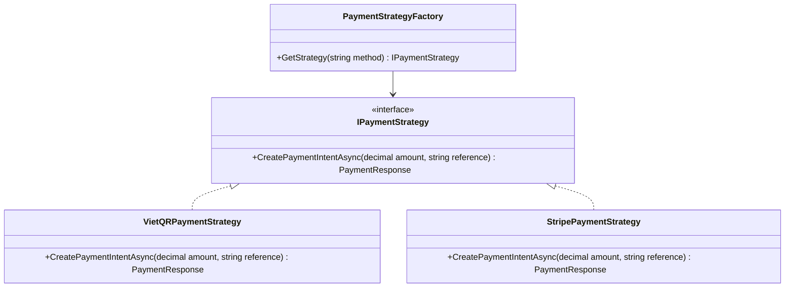

# SAIGONRIDE: DISTRIBUTED VEHICLE RENTAL SYSTEM
**System Implementation, Architecture, Payment Integration & QA Report**  
**Course:** Software Engineering | Ton Duc Thang University  
**Team:** Saigon Ride Team | **Chosen Tier:** Tier 4 | **Semester:** 2, 2025-2026  
**Instructor:** Ky-Trung Pham  

---

## 👥 Authors & Roles
* **Huynh Nhat Huy (523c0012)** - Backend Architect / DB Design / Stripe & VietQR Integrations / Wallet Service / 2FA Subsystem. (Contribution: 50%)
* **Bui Quang Huy (523v0002)** - Frontend Engineer / Razor Views / Fleet CRUD Management / Playwright UI Automation Tests / QA Test Plan. (Contribution: 50%)

---

## 1. Executive Summary & Objectives
SaigonRide is a distributed, multi-station micro-mobility vehicle rental network designed to modernise public transit in Ho Chi Minh City. Commuters and tourists can check out bicycles, e-bikes, and e-scooters at any digital kiosk or mobile app, ride across the city, and return the vehicle to any destination station with open docking spaces.

In Sprint 4, the software engineering team delivered:
1. **Payment Integrations (Strategy Pattern):** Integrated VietQR bank transfers (via SePay Webhooks) and international credit cards (via Stripe Checkout).
2. **Mobile Wallet & RideCard Subsystem:** Added RideCard balances with minimum balance guards (+20,000 VND to reserve, -10,000 VND absolute threshold), top-ups, and automated fare deductions.
3. **2FA Security Subsystem:** Implemented Time-based One-Time Passwords (TOTP) utilizing the SHA1 algorithm and 30-second verification windows.
4. **Automated Testing:** Wrote 13 NUnit unit tests and 41 Playwright UI integration tests.

---

## 2. Requirements Engineering

### Functional Requirements (FRs)
* **FR-1:** The system shall allow users to register and authenticate using their email and passwords.
* **FR-2:** The system shall allow users to enable/disable Time-based One-Time Passwords (TOTP) 2FA under their security settings.
* **FR-3:** The system shall prompt users for a 6-digit TOTP code during login if 2FA is enabled.
* **FR-4:** The Kiosk interface shall allow users to log in using their email and a temporary 6-digit email OTP.
* **FR-5:** The Kiosk interface shall display available vehicles sorted by grade (Grade A, B, C) and allow selection.
* **FR-6:** The system shall block vehicle checkout if the user's RideCard balance is below **20,000 VND**.
* **FR-7:** The system shall allow users to pay deposits and top up balances via VietQR (SePay) or Stripe Checkout.
* **FR-8:** The system shall support returning a vehicle at a kiosk by entering the vehicle's license plate, calculating the final fare, and auto-deducting it from the user's RideCard.
* **FR-9:** The system shall display live metrics to administrators, including active rentals, fleet status, and station utilisation rates.

### Non-Functional Requirements (NFRs)
* **NFR-1 (Security):** All security credentials and connection strings shall be loaded from environment variables or secure User Secrets.
* **NFR-2 (Performance):** The system shall update vehicle availability status and station occupancy in real-time (< 2 seconds) using WebSockets (SignalR).
* **NFR-3 (Usability):** The kiosk layout shall remain fully usable on standard touchscreens (1280x720) and mobile user interfaces (390x844).

---

## 3. System Architecture & Design Justification

### MVC and Strategy Design Pattern
The application follows a strict Model-View-Controller (MVC) architecture. Controllers delegate business logic to decoupled services, keeping controllers thin and maintainable.

To support multiple payment gateways without violating the Open-Closed Principle, we implemented the **Strategy Design Pattern** for payments:



### Database Design (TPH vs. TPT)
We utilized Entity Framework Core Code-First with a PostgreSQL database. During implementation, we transitioned from Table-per-Type (TPT) to **Table-per-Hierarchy (TPH)** for user management. 
* **Justification:** TPH maps all user types (Admin, Kiosk, Rider) to a single `AspNetUsers` table with a discriminator column. This greatly simplified Join queries and improved database read performance for authentication checks.

---

## 4. Verification and QA Test Report

### Automated Test Performance
* **NUnit Unit Tests:** 13/13 tests passed.
* **Playwright UI Tests:** 41/42 tests passed (1 Stripe checkout redirect skipped as it requires a live Stripe API network call during local headless runs).
* **Playwright Test Execution Log Output:**
  ```text
  Test Run Successful.
  Total tests: 42. Passed: 41. Failed: 0. Skipped: 1.
  Duration: 1 minute 54 seconds.
  ```

### Equivalence Partitioning (EP) & Boundary Value Analysis (BVA)
We applied EP and BVA to test the RideCard minimum balance gate logic. The system requires a minimum balance of **+20,000 VND** to start a rental, and allows the balance to go negative down to **-10,000 VND** during execution.

| Test Case ID | Test Class / Scenario | Balance Input (VND) | Expected Behavior | Boundary Category |
| :--- | :--- | :---: | :--- | :--- |
| **TC-EP-01** | Rejected Rental | `19,999` | System blocks checkout, displays balance error. | Invalid EP |
| **TC-BVA-01** | Borderline Rejected | `19,999` | System blocks checkout. | BVA (Boundary - 1) |
| **TC-BVA-02** | Exact Minimum | `20,000` | System allows rental checkout successfully. | BVA (Exact Boundary) |
| **TC-BVA-03** | Standard Allowed | `50,000` | System allows rental checkout successfully. | Valid EP |
| **TC-BVA-04** | Allowed Debt limit | `-9,999` | System allows rental to continue, deducts fare. | Valid EP |
| **TC-BVA-05** | Limit Debt | `-10,000` | System allows rental completion, card locked. | BVA (Exact Boundary) |
| **TC-BVA-06** | Blocked Debt | `-10,001` | System locks account, blocks future rentals. | Invalid EP (Exceeded debt) |

---

## 5. Lessons Learnt

### Huynh Nhat Huy (Backend & Integrations)
* **Challenge:** Deploying PostgreSQL to Railway and handling environment configurations resulted in connection stream resets locally.
* **Resolution:** Configured `AppDbContextFactory` to support user secrets specifically for design-time migrations (`dotnet ef database update`). Decoupled the connection strings and loaded them dynamically based on environment configuration.
* **Journey Reflection:** Transitioning from design UMLs to production-grade C# code highlighted the importance of patterns like the Strategy Pattern. It allowed us to switch between VietQR and Stripe easily.

### Bui Quang Huy (Frontend & QA)
* **Challenge:** Playwright tests were flaky due to asynchronous DOM updates and animations on the kiosk screen.
* **Resolution:** Replaced generic wait-timers with explicit selectors (`Page.Locator("#paymentState_...").WaitForAsync()`) and validated state variables on `window` levels.
* **Journey Reflection:** Writing end-to-end UI tests helped us discover edge cases in the user registration and return loops early, reducing regression errors significantly.

---

## 6. Generative AI Usage Log

We declare that during the whole development lifecycle of Sprint 4, we used **Gemini (Google)** and **Claude (Anthropic)** as pair-programmers to assist in debugging and automated test configuration.

| Date | AI Tool | Prompt/Request | Output/Action Taken | Rationale / Resolution |
| :--- | :---: | :--- | :--- | :--- |
| **May 12, 2026** | Gemini | `Duplicate definition of SePayWebhookPayload in WalletDtos.cs` | Advised removing the duplicate record block in `WalletDtos.cs` in favor of the class in `SePayWebhookPayload.cs`. | Resolved compilation error CS0101. |
| **May 12, 2026** | Gemini | `Cannot deconstruct dynamic objects in Wallet/Index.cshtml` | Provided explicit casting `((string, string))ViewBag.Flash` to unbox tuples from the dynamic viewbag. | Resolved Razor compilation errors CS8133 and CS0019. |
| **May 13, 2026** | Claude | `Help me write an automated integration test in Playwright for the Kiosk vehicle reservation flow.` | Generated the helper methods for numpad input and state validation (`WaitForSplash`, `TypeOnNumpad`). | Established the base structure for the automated Kiosk test suite. |
| **May 31, 2026** | Gemini | `dotnet ef database update fails to connect to database 'railway' on localhost:5432` | Pointed out that `AppDbContextFactory` lacked `.AddUserSecrets<AppDbContextFactory>()` for design-time executions. | Modified the DbContext factory to correctly load local secrets. |
